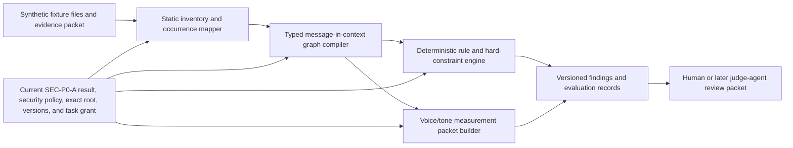

# v0 architecture and bounded-build decision packet

## Decision requested

> **Research disposition, 18 August 2026:** this `r1` packet is not decision-ready. Its `SIBF-CHK-001/design-0.1` fixture binding includes a falsified expression denominator. Do not approve it as written. A [successor fixture design contract](SIBF-CHK-DESIGN-CONTRACT-0.2.md) and [successor architecture proposal](CDM-V0-ARCH-DECISION-r2.md) now exist only as proposed, non-executable review artifacts. No approved successor fixture release/task binding or approved architecture decision currently exists.

Return for revision or reject the following **planning boundary**:

> Prepare an implementation plan for a local, static, read-only v0 harness that compiles a typed content-decision graph and deterministic rule results from the synthetic `SIBF-CHK-001` checkout-recovery fixture, produces versioned evaluation packets, and performs no source mutation, network access, external model call, connector use, credential use, publication, or autonomous content decision.

This `r1` packet currently authorizes nothing and cannot be approved as written. If a future successor packet with a valid fixture binding is approved, that approval may authorize implementation **planning only**. It would not authorize executable scaffolding, dependency installation, browser or desktop operation, model processing, external research, account access, fixture mutation, evidence persistence, product comparison, or release. Each later action retains its own phase gate, exact task grant, and applicable control records.

## Why this is the proposed first build boundary

**[Inference]** The research does not support starting with a universal writer or repo-wide autonomous content owner. The first build should test the hardest reusable substrate—grounded decision representation, string/state discovery, typed uncertainty, deterministic constraints, and evaluation—inside one bounded journey before adding models, connectors, or mutation.

This boundary follows:

- the [candidate content-decision system model](../08-synthesis/candidate-system-model.md);
- the [security, privacy, and trust boundaries](../05-technology/security-privacy-and-trust-boundaries.md);
- the [repository and agent integration model](../05-technology/repository-and-agent-integration.md);
- the [evaluation and benchmark contract](../06-evaluation/evaluation-and-benchmarks.md);
- the [product-study and judge-agent system](product-study-and-judge-agent-system.md);
- the [voice/tone graph and measurement proposal](voice-tone-graph-and-measurement.md);
- the [shared synthetic fixture specification](shared-benchmark-fixture-specification.md); and
- the [Phase 4 acquisition gate](materials-and-access-register.md#phase-4--static-read-only-harness).

## Proposed v0 system

The diagram is a proposed dependency structure, not implemented behavior.

## Architecture decisions in scope

| Decision | v0 choice | Reason | Deferred alternative |
| --- | --- | --- | --- |
| Primary semantic unit | A versioned message-in-context decision linked to expressions and occurrences | Keeps meaning, locale expression, implementation, and state distinguishable | Flat string inventory as the sole data model |
| Knowledge representation | Disposable experiment-scoped typed graph records with stable IDs and explicit relationships | Tests whether the candidate model can preserve provenance, conflict, reuse, and many-to-many mappings; it does not validate or stabilize the schema | One monolithic Markdown prompt, untyped vector-only memory, or premature public schema |
| Rule layer | Deterministic hard constraints and declared rule profiles | Makes factual, structural, terminology, accessibility, locale, and safety failures inspectable | One blended LLM score |
| Voice/tone layer | Multidimensional measurement packet with hard eligibility first | Voice and tone are contextual, non-compensatory where facts/safety fail, and require calibration | Universal scalar “brand fit” or industry stereotype |
| Agent boundary | No autonomous model agent in the first executable condition | Separates graph/rule correctness from model/provider variability and data processing | Immediate external-model generation or self-approval |
| Evaluation | Deterministic checks plus versioned human-rating packets; judge agents added only after calibration and control approval | Supports reproducibility and preserves abstention/disagreement | Single uncalibrated LLM-as-judge verdict |
| Fixture | Historical binding: `SIBF-CHK-001` design revision 0.1, limited to workflow Stages 3, 5, and 6; not eligible for approval | The journey scope remains useful, but open materialization falsified the 34-expression denominator; a normalized successor identity manifest and task binding are required | Approving this stale binding, claiming workflow Stages 1–6, or using a real repository |
| Execution | One controlled local harness process; scanned fixture content is always inert data | A harness must run, but fixture content must never launch code or widen capability | Executing repository scripts, build hooks, plugins, or embedded instructions |
| Reads | Exact allowlisted fixture root and versioned profile files only | Proves least-privilege discovery and reproducibility | Home-directory, workspace-wide, personal, production, or connector reads |
| Writes | None to fixture, repository source, accounts, or remote systems; results ephemeral unless a separately approved append path is introduced later | Keeps the first condition genuinely non-mutating | Patch/apply, CI enforcement, publication, or remote sync |
| Network and credentials | Disabled | Removes external network/model/credential use from this condition; it does **not** remove local prompt-injection risk, seeded-secret risk, runtime telemetry, retention, dependency, provenance, or supply-chain obligations | Web research, model/API calls, MCP, accounts, OAuth, tokens |

### Experimental-schema boundary

The candidate system model is not validated for a public schema. The prerequisite practitioner program—at least 50 threshold-eligible decisions across the declared diversity cells, non-English-first work, engineering mappings, accessibility and localization representation, and conflict cases—has not run.

**[Proposal]** v0 may therefore use only a disposable `experimental-0.1` instrument schema whose purpose is to expose model failures against synthetic material. It must:

- identify itself as experimental in every schema, output, report, and fixture link;
- make no compatibility, migration, stability, completeness, or canonical-field promise;
- preserve unknown, disputed, absent, and unsupported values rather than forcing the candidate ontology to fit;
- record any field or relationship that the fixture cannot represent without silently changing the authoritative candidate model; and
- remain replaceable after practitioner evidence without treating its frequency or implementation as approval.

Executable readiness for this synthetic condition is not schema validation. No `CONTENT.md` format, production adapter, real-repository migration, or public contract can inherit authority from this prototype.

## Supported first operations

The implementation plan may cover only these candidate operations:

1. validate fixture and profile versions, hashes, identifiers, relationships, and declared counts;
2. statically enumerate candidate strings and user-facing occurrences under the exact fixture root;
3. distinguish messages, expressions, occurrences, locale branches, variables, markup, selectors, accessible names/status, product delivery, communication-attempt eligibility and dispatch/provider/client events, recipient-engagement events, and evaluation records;
4. compile the declared typed graph without resolving unknown or disputed facts by plausibility;
5. evaluate deterministic fixture rules, mutation probes, and malicious-input guards without executing fixture content;
6. generate versioned human-evaluation packets for voice/tone calibration without assigning gold linguistic judgments; and
7. emit an ephemeral machine-readable result and a human-readable summary with provenance, limitations, and explicit unsupported operations.

Every unlisted operation is denied.

## Non-goals

v0 will not:

- publish a canonical `CONTENT.md` specification;
- write or rewrite production strings;
- scan an arbitrary real repository;
- infer product behavior, policy, legal applicability, owner, approver, approval, implementation, release, or user outcome;
- detect whether a human or AI authored text;
- declare a universal voice for an industry, culture, market, or locale;
- translate or judge `fr-CA` or `ar-EG` linguistic quality without qualified people and an approved language path;
- use embeddings, fine-tuning, retrieval services, an external model, or an agent host;
- install a competitor product or compare product performance;
- execute repository code, package scripts, build hooks, browser automation, or child processes from scanned content;
- create a connection, credential, durable memory, telemetry stream, account, workspace, or publication; or
- claim complete workflow, product, security, accessibility, localization, regulatory, or outcome validation.

These exclusions narrow the first condition; they do not shrink the program's end goal. Later phases add model agents, connectors, controlled mutation, desktop product studies, and end-to-end journey validation only after their own evidence and control gates pass.

## Required contents for a future successor plan after valid approval

The next artifact—not code—must define:

1. exact repository/file layout and versioned schema/profile boundaries;
2. fixture materialization plan and signed manifest;
3. canonical operations, inputs, outputs, errors, and refusal records;
4. parser and framework adapters needed only for the synthetic fixture;
5. an owned threat model and exact SEC-P0-A profile, evidence requirements, result schema, expiry/invalidation rule, and denial behavior before static discovery can be released;
6. data classification and disclosure review, seeded-secret and sensitive-pattern tests, deterministic CPU/memory/file-count/size/time bounds, and truthful-claim checks;
7. dependency and supply-chain plan covering pinned sources/hashes, license review, SBOM/provenance, update policy, vulnerability disposition, uninstall/cleanup, and no hidden install scripts;
8. SEC-P0-B through SEC-P0-G applicability or explicit not-applicable rationales, without treating a P0 result as task authority;
9. exact capability phase, root, data, process, network, credential, and persistence boundaries plus an independently constructed exact task grant for each run;
10. deterministic test matrix, malicious fixtures, negative tests, and reproducibility runs;
11. expected-current/version mismatch, interruption, cancellation, cleanup, and result-disposition behavior;
12. independent verification procedure and evidence package; and
13. explicit expansion gates for models, agent roles, real repositories, writes, desktop products, and release.

## Acceptance gate before any executable may be called ready

| Plane | Minimum evidence |
| --- | --- |
| SEC-P0-A release eligibility | A current owned SEC-P0-A `pass` record proves threat-model coverage, data classification/disclosure, seeded-secret safety, deterministic resource limits, supply-chain provenance/SBOM and vulnerability disposition, install/uninstall/cleanup behavior, and truthful scope claims; missing, expired, invalidated, or blocked evidence denies execution |
| Per-run authority | The requested mode, declared static-discovery phase, current gate-result ID/version, and independently issued exact task-grant ID/version/constraints remain separate; the grant binds principal/workload, tool, operation, resource, data, environment, issue/expiry, and current revocation check |
| Scope | Reads only the exact enrolled fixture/profile roots and rejects traversal, links, aliases, or configuration that escape them |
| Inertness | Fixture strings, Markdown, comments, metadata, and adversarial instructions cannot cause code, shell, build, browser, connector, network, or model execution |
| Determinism | Same versions and inputs produce byte-identical deterministic records across at least two clean starts |
| Model fidelity | Semantic messages, expressions, occurrences, locales, states, evidence, controls, decisions, product delivery, communication-attempt eligibility and repeatable dispatch/provider/client events, recipient-engagement events, and evaluations remain separate and round-trip without loss |
| Unknowns/conflicts | Every deliberate unknown and conflict remains unresolved unless exact supplied evidence and an authorized decision record resolve it |
| Hard constraints | A hard failure cannot be averaged away by voice/tone or contextual scores |
| Fixture coverage | Declared Stage 3/5/6 packet IDs, routes, counts, probes, mutation guards, and malicious fixtures resolve to the signed fixture version |
| No writes/egress | Tests demonstrate no source, repository, account, remote, network, credential, model, or unapproved persistence effect |
| Failure behavior | Missing, stale, mismatched, malformed, unsupported, or out-of-scope inputs fail closed with typed records rather than silent repair |
| Experimental-schema honesty | Every schema/output is marked `experimental-0.1`; unsupported candidate-model relationships are reported; no result claims the practitioner prerequisites, public schema stability, migration contract, or production fitness |
| Independent review | A verifier other than the implementation author reproduces the test evidence and finds no unresolved critical boundary defect |

Passing this gate would validate only the declared static condition. It would not approve a model agent, production use, mutation, publication, or public specification.

## Approval record to create if accepted

P4-01 closes only through a structured record that binds authenticated identity and actual decision capacity. One person may hold more than one role only when each capacity and its basis are stated separately; authorship, file custody, job title, or chat participation does not imply authority.

An acceptance record must bind:

| Field | Required value |
| --- | --- |
| Decision packet | `CDM-V0-ARCH-DECISION-r1` |
| Decision | For this falsified `r1` binding: `returned_for_revision` or `rejected`. A future successor packet may define `approved_for_implementation_planning` after its fixture binding exists |
| Fixture | Must name an approved successor to `SIBF-CHK-001/design-0.1`; none exists, so `CDM-V0-ARCH-DECISION-r1` cannot currently be approved |
| Approved scope | Exact planning boundary and supported operations above |
| Conditions/exclusions | Any change to the proposed constraints |
| Repository/product-owner decision | Authenticated person or controlled identity, capacity, delegation/source of authority, scope, decision, and timestamp |
| Research/system-architecture-owner decision | Authenticated person or controlled identity, capacity, delegation/source of authority, scope, decision, and timestamp; may equal the repository owner only when both capacities are explicit |
| Security/privacy consultation | Exact reviewer/owner identities or controlled roles, consultation-record IDs/versions, reviewed boundary, concerns/conditions, disposition, and date; consultation is not a capability grant or certification |
| Effective period and review trigger | Effective date, expiry or review date, revocation route, and change triggers including fixture, operation, schema, dependency, model/network/write boundary, or security assumptions |

The record is a semantic and architecture planning decision. It is not a capability grant, mutation approval, release approval, security certification, privacy approval, or product-quality finding.

## Response and closure format

Because the fixture binding is falsified, `approval as written` is not a valid direction for this `r1` packet. The following messages record the remaining possible direction but do **not** by themselves close P4-01:

- `Return CDM-V0-ARCH-DECISION-r1 for revision: [exact change].`
- `Reject CDM-V0-ARCH-DECISION-r1: [reason or replacement direction].`

No implementation planning may begin from `CDM-V0-ARCH-DECISION-r1`. `CDM-V0-ARCH-DECISION-r2` remains a proposal with no fixture binding or planning authority. After an exact successor fixture release and task binding are formally approved, the r2 packet must bind those immutable values and must still obtain the repository/product-owner decision, research/system-architecture-owner decision, and security/privacy consultation records before it can become `approved_for_implementation_planning`.
