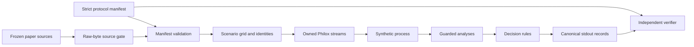

# Voice and tone offline simulator implementation specification

## Decision and boundary

**[Proposal]** Build a deterministic, single-process Python application that projects the reviewed [measurement simulation protocol](voice-tone-measurement-simulation-protocol.md) into strict machine-readable manifests, schemas, generators, estimators, decision rules, records, and an independent verifier.

The simulator answers one narrow question: under frozen synthetic assumptions, when do proposed voice-and-tone measurement designs return defined, correctly scoped, uncertainty-aware outputs, and when must they stop or return a typed null state?

This specification authorizes no code or run. The user's instruction authorizes this specification and its companion implementation plan only. A future implementation decision must separately name the package root, dependency artifacts, allowed writes, tests, operator, review requirements, and execution limits.

The implementation must never:

- browse, call a network service, invoke a model or agent, inspect an account, or use Chrome;
- ingest production copy, participant data, customer data, credentials, real organization profiles, hidden evaluators, or external corpora;
- infer construct validity, cognitive validity, human-pilot results, product quality, organization voice, user benefit, or a universal threshold;
- turn an unsupported or undefined estimate into zero, `0.5`, a fabricated confidence, a rank, or a pass;
- treat a successful synthetic run as approval of an estimator, interval, threshold, sample size, exclusion, graph rule, or calibration rule; or
- write persistent result artifacts unless a later, exact persistence decision authorizes a bounded append path.

The full `32,858`-scenario run remains a later gate. Version `0.1.0-candidate` exposes validation and bounded conformance commands only.

## Bound source snapshot

Every build and bounded conformance invocation must verify the raw UTF-8 bytes below before loading the machine-readable projection. A mismatch returns `invalid_run/source_hash_mismatch` before scenario generation.

| Source | Required SHA-256 |
| --- | --- |
| `voice-tone-measurement-simulation-protocol.md` | `9c7d0ecd64b5f32543fc2a16b69c65fa1ad97c9c3f209cd15a866e5c8dd7bcb8` |
| `voice-tone-measurement-simulator-implementation-readiness-review-2026-08-19.md` | `bb774c87b8c9efdbd8291449d2026178812e707395a1ba2e7c0b854e4459ad4d` |
| `voice-tone-measurement-estimand-and-coverage-specification.md` | `46cb3198471bffe0e1159f005d56c83db881a5ca054f502a6d63f227288361d7` |
| `voice-tone-measurement-primary-research-notes-2026-08-17.md` | `f4d8c21a1ffebf7048dbdf441030f487aaf12cedca3a257bcec0d63f63a3d35c` |
| `voice-tone-human-calibration-instrument.md` | `cd72336240fa79afed74ad0892967439f231051c6ca49a6e296d8018c767ca8e` |
| `voice-tone-graph-and-measurement.md` | `b2d9512c904038faf7fb113fa15f98d9a50a4f0e7c713f6e2f53cb3d622b3384` |
| `product-study-and-judge-agent-system.md` | `1f2782f10d180c120798746e267e4b58e40e1b3f6b870d1a98e5d5ec91720946` |
| `voice-tone-synthetic-calibration-development-bundle.md` | `21dd80efb1c2190b75f6367fe4fbcfa7a2dd4ac7762ac1e184074b52c7285f12` |
| `materials-and-access-register.md` | `51121966ef93d68ccc83fbced3a2e8f1bc0254c64c3a01edda97471aa70a6292` |
| `research-protocol.md` | `ed9ba9bc2714a53cf107043e00eee6433ab453d9425a58842adc50abdf685ac4` |
| `security-privacy-and-trust-boundaries.md` | `7841c183b42c0cbb9c921b93644e68e9120b9b8f1fef3e8820257458057c6da6` |

The first two rows bind the implementation design and its readiness basis; the remaining nine reproduce the paper protocol's source manifest. The protocol remains normative. Machine-readable files are a lossless projection, not an independent authority. A projection conflict is fatal and must be resolved by revising and re-reviewing the projection or its source; runtime code may not guess. A future `SIM-I0` record must additionally bind the exact hashes of this specification and its companion plan; they are not self-referential source rows here.

## Chosen implementation shape

### Why a Python library and CLI

The candidate is a small Python library with a thin command-line interface. Python keeps schema validation, array computation, deterministic tests, and independent verification in one offline process. The application has no server, database, browser surface, plugin system, notebook dependency, job queue, or background worker.

The primary engine and the independent verifier share only immutable protocol data and small canonicalization primitives. The verifier does not import grid, generator, analysis, decision, or report modules from the primary engine.



### Future package root

The only proposed implementation root is:

`tools/voice-tone-simulator/`

No source file may read above that root except the exact hash-bound documentation paths declared in the approved runtime manifest. Tests may use an automatically created operating-system temporary directory and must delete it at terminal cleanup.

## Runtime and dependency profile

### Candidate runtime lock

| Component | Exact candidate | Use | Boundary |
| --- | --- | --- | --- |
| Python | `3.12.13` | Application and tests | Exact interpreter executable and binary SHA-256 recorded at build time |
| NumPy | `2.3.5` | Dense arrays and explicit linear algebra | No implicit random generator; every random variate comes from the owned Philox adapter |
| Pydantic | `2.13.4` | Closed runtime models and validation | Every model rejects unknown fields and type coercion |
| `pydantic-core` | `2.46.4` | Exact validation engine required by Pydantic | Platform-specific artifact hash and ABI must be frozen |
| `annotated-types` | `0.7.0` | Pydantic dependency | No direct simulator API use |
| `typing-extensions` | `4.16.0` | Pydantic dependency | No direct simulator API use |
| `typing-inspection` | `0.4.2` | Pydantic dependency | No direct simulator API use |
| `rfc8785` | `0.1.4` | RFC 8785/JCS canonical bytes | Acquire only from a separately approved artifact; expected wheel SHA-256 `520d690b448ecf0703691c76e1a34a24ddcd4fc5bc41d589cb7c58ec651bcd48` |
| Python standard library | Python `3.12.13` | `hashlib`, `json`, `argparse`, `dataclasses`, `decimal`, `unittest`, temporary files | No third-party test runner or serializer |

The locally available Python, NumPy, Pydantic and four Pydantic dependency versions match this candidate profile. `rfc8785` is not installed. Its future acquisition is a separate supply-chain step; installing it is not authorized by this document. The [official PyPI release page](https://pypi.org/project/rfc8785/) identifies `0.1.4` as a pure-Python RFC 8785 implementation and publishes the wheel hash used above. `requirements-build.txt` must name and hash all seven third-party distributions; an installed version without its approved artifact filename and hash is insufficient for `SIM-I1`.

Pandas, SciPy, statsmodels, PyArrow, pytest, Hypothesis, dynamic plugins, and compiled estimator extensions are excluded from `0.1.0-candidate`. The small required solvers are implemented explicitly with NumPy and tested against frozen vectors. Adding a dependency changes the runtime manifest and requires review.

### Build and dependency rules

1. Build inputs are exact local wheels or source already named in an approved dependency manifest.
2. Every artifact is hashed before installation; hashes and licenses are recorded.
3. Installation and tests run with network access disabled.
4. No install hook, post-install script, VCS dependency, unpinned range, editable dependency, or environment-supplied plugin is allowed.
5. The build record binds Python executable hash, operating system, architecture, dependency filenames and hashes, source-tree hash, protocol-manifest hash, and test command.
6. A build with an unknown dependency, source drift, or unresolved license is invalid and produces no candidate release.

## Proposed package layout

```text
tools/voice-tone-simulator/
├── README.md
├── pyproject.toml
├── requirements-build.txt
├── src/vt_simulator/
│   ├── __init__.py
│   ├── cli.py
│   ├── errors.py
│   ├── canonical.py
│   ├── models.py
│   ├── manifest.py
│   ├── grid.py
│   ├── philox.py
│   ├── streams.py
│   ├── schedule.py
│   ├── process.py
│   ├── numerics.py
│   ├── estimands.py
│   ├── analysis.py
│   ├── decisions.py
│   ├── records.py
│   ├── report.py
│   ├── runner.py
│   └── verify.py
├── protocol/
│   ├── manifest.vt-msp-design-0.1.json
│   ├── factors.vt-msp-design-0.1.json
│   ├── methods.vt-msp-design-0.1.json
│   ├── statuses.vt-msp-design-0.1.json
│   ├── leakage.vt-msp-design-0.1.json
│   └── schemas/
│       ├── design-record.schema.json
│       ├── scenario-record.schema.json
│       ├── run-record.schema.json
│       ├── assignment-record.schema.json
│       ├── rating-record.schema.json
│       ├── mapping-record.schema.json
│       ├── calibration-record.schema.json
│       ├── replicate-record.schema.json
│       ├── metric-record.schema.json
│       ├── probability-record.schema.json
│       ├── interval-record.schema.json
│       ├── decision-record.schema.json
│       ├── provenance-record.schema.json
│       └── review-record.schema.json
├── tests/
│   ├── fixtures/
│   │   ├── philox-vector.json
│   │   ├── grid-counts.json
│   │   ├── canonicalization-vectors.jsonl
│   │   ├── null-status-cases.jsonl
│   │   └── leakage-matrix.jsonl
│   ├── test_canonical.py
│   ├── test_models.py
│   ├── test_manifest.py
│   ├── test_grid.py
│   ├── test_philox.py
│   ├── test_streams.py
│   ├── test_schedule.py
│   ├── test_process.py
│   ├── test_numerics.py
│   ├── test_estimands.py
│   ├── test_analysis.py
│   ├── test_decisions.py
│   ├── test_records.py
│   ├── test_report.py
│   ├── test_cli.py
│   ├── test_leakage.py
│   └── test_end_to_end.py
└── verify_snapshot.py
```

`verify_snapshot.py` is a dependency-minimal executable verifier. It uses the Python standard library plus the exact verified `rfc8785` distribution and must not import `vt_simulator.grid`, `vt_simulator.process`, `vt_simulator.analysis`, `vt_simulator.decisions`, or `vt_simulator.report`.

## Module contracts

| Module | Required inputs | Required outputs | Must not do |
| --- | --- | --- | --- |
| `canonical` | JSON-compatible values and an explicit omitted-field set | RFC 8785 bytes, SHA-256 digest, validated lowercase-hex ID | Coerce numbers, accept non-finite values, reorder arrays, or silently drop fields |
| `models` | Parsed JSON objects | Frozen Pydantic records with `extra='forbid'` and strict types | Fill defaults that are not explicit in the manifest |
| `manifest` | Approved manifest root and exact paper-source root | `ValidatedProtocol` or one typed fatal error | Follow symlinks, read undeclared paths, accept hash drift, or merge profiles |
| `grid` | `ValidatedProtocol` | Ordered prededup rows, unique scenario records, sorted membership sets, count report | Include arm membership in scenario identity or accept short-ID collision |
| `philox` | Exact unsigned words and counter | Frozen output words and uniform values | Delegate to NumPy's RNG or change word/counter order |
| `streams` | Scenario/population block, replicate, stream and target coordinates | Owned immutable stream plus consumption ledger | Share streams, adaptively reseed, skip required draws, or use mutable global state |
| `schedule` | Frozen schedule profile and identities | Ordered assignment/session schedule | Depend on outcome, missingness, or estimator result |
| `process` | Scenario, schedule and owned streams | Synthetic truth, disposition, response, band, calibration, graph and counterfactual records | Read prose/message text or invoke an external model |
| `numerics` | Explicit arrays, method profile and tolerances | Value, convergence state, iteration count and diagnostic | Use runtime-specific defaults or return a value after a failed guard |
| `estimands` | Valid records plus exact estimand ID | Typed estimator request or typed unsupported result | Invent an estimand or scalarize hard and soft measures |
| `analysis` | Guard-passed estimator request | Estimate, probability and interval records with exact status unions | Convert unsupported/undefined/nonconverged outputs to numeric values |
| `decisions` | Valid metric/interval records and rule profile | One scoped paper disposition per applicable rule | Approve a threshold, sample, method, construct, pilot, or product claim |
| `records` | Immutable typed records | Canonical hashes, reference checks and streamable canonical JSON | Repair invalid records, mutate prior records, or generate authority |
| `report` | Validated records only | Deterministic summary records in canonical JSON Lines | Omit failures from denominators or use persuasive success language |
| `runner` | One bounded command envelope | Ordered records and terminal status | Expose the complete-grid run in `0.1.0-candidate` |
| `verify` | Immutable output stream and approved protocol files | Independent pass/fail facts | Trust engine totals, summaries, digests or claimed source state |

## Protocol projection

### Root manifest

Before hashing, `manifest.vt-msp-design-0.1.json` has exactly this preimage shape:

```json
{
  "schema_version": "vt-sim-protocol-manifest/0.1",
  "protocol_id": "VT-MSP/design-0.1",
  "implementation_candidate_id": "vt-sim/0.1.0-candidate",
  "source_locks": [],
  "profile_refs": {},
  "schema_refs": [],
  "negative_control_refs": [],
  "expected_counts": {},
  "runtime_constraints": {},
  "interpretation_boundary": {}
}
```

All shown members are required. After construction, `record_hash` is computed from that preimage and added as the completed object's only additional top-level member. Lists are sorted by their declared stable IDs, not incidental filesystem order.

The exact count object is:

```json
{
  "prededup_rows": 33012,
  "unique_scenarios": 32858,
  "duplicate_memberships": 154,
  "multi_arm_bundles": 133,
  "deterministic_leakage_cases": 64,
  "estimands": 11,
  "factor_keys": 26
}
```

The manifest must carry the complete 26-factor vocabulary, exact levels and typed values; the four targets; all arm-expansion rules; the exact baseline preimage and hash; population-block preimages and hashes; schedule, generating, math and analysis profiles; all method and interval IDs; closed status/reason vocabularies; metric applicability; Monte Carlo rules; leakage cases; and the nine paper source locks. No value may be parsed from Markdown at runtime.

### Record envelope

Every record family carries:

- `schema_version` and `record_type`;
- the protocol, implementation, runtime-manifest and source-manifest digests;
- exact scenario, target, profile, method and input references applicable to that family;
- one typed status/value/reason union;
- a deterministic ordinal within its stream;
- `record_hash_algorithm: "sha256"`;
- `record_hash`, computed over RFC 8785 canonical bytes with only that field omitted; and
- no runtime timestamp inside any scientific identity or hash preimage.

Wall-clock timestamps may exist only in a separately hashed execution provenance record. Scientific ordering uses stable IDs and ordinals.

### Value and status invariants

The implementation must project the protocol's closed run, estimate, truth, probability, interval, terminal, and disposition vocabularies exactly. Each union is mutually exclusive:

- a successful value status requires a finite value and null reason;
- an unsupported, undefined, invalid, not-run, not-attempted, nonconverged, or precision-unmet status requires a null value and one allowed exact reason;
- interval success requires finite ordered bounds, exact confidence level and interval method ID;
- a probability is never imputed for a missing prediction;
- a missing interval remains an explicit blocking record rather than disappearing from a denominator; and
- `unsupported`, `undefined`, `not_attempted`, `invalid_run`, and `estimator_failure` remain distinct.

Schema validation covers field shapes and local unions. Cross-record validation additionally proves references, target/method applicability, scenario/replicate uniqueness, hash identity, denominator membership, and absence of contradictory states.

## Canonicalization and identity

1. JSON is decoded with duplicate-key rejection.
2. Numeric scientific inputs are the protocol's exact decimal strings until a method explicitly converts them to IEEE-754 binary64, round-to-nearest ties-to-even.
3. Negative zero, NaN, positive/negative infinity, unknown keys and implicit defaults are fatal.
4. `ScenarioParameterPreimage` contains exactly the eight keys and 26-factor object defined by the protocol.
5. `scenario_parameter_hash = SHA256(JCS(preimage))`.
6. `scenario_id = "SIM-" + first_20_lowercase_hex(scenario_parameter_hash)`.
7. The full parameter digest is the primary key; any short-ID collision invalidates the grid.
8. Arm membership is unioned and sorted only after deduplication and is excluded from scenario identity.
9. Record hashes omit only their own `record_hash`; every other field is immutable input to the digest.

Canonicalization tests include the RFC 8785 package's behavior, repository-specific baseline preimage, non-ASCII strings, object-key ordering, array-order preservation, duplicate keys, integer boundaries, decimal-string validation, negative zero and non-finite rejection.

## Grid generation and independent oracle

The primary grid expands the locked arm definitions in declared arm order, produces complete scenario preimages, hashes each preimage, deduplicates on the full digest, and unions sorted arm memberships. It emits:

- one prededup membership record per arm row;
- one scenario record per full parameter hash;
- one duplicate-membership report;
- one short-ID uniqueness report; and
- exact aggregate counts.

The independent oracle reimplements arm iteration with separate nested-loop code and set/dictionary operations. It reads the protocol manifest but does not import primary grid code. A conformance candidate passes only if both implementations independently return `33,012`, `32,858`, `154`, and `133`, identical scenario full-hash sets, identical short IDs, and identical sorted membership sets.

## Deterministic random streams

`philox.py` implements Philox-4x32-10 directly with unsigned 32-bit arithmetic and frozen multiplication/key-bump constants. It accepts explicit four-word counters and two-word keys, emits words in `c0,c1,c2,c3` order, and increments the 128-bit counter as one unsigned big-endian integer.

`streams.py` derives keys, counters and `stream_fingerprint` from the protocol's exact SHA-256 coordinate formula. It enforces:

- the master seed and exact coordinate separators;
- `replicate_index` grammar and ranges;
- population-block substitution for finite-effect streams;
- named stream ownership;
- exact per-object draw order and allotment even when values become unused;
- no duplicate coordinate ownership;
- no cross-stream or cross-target reuse; and
- a terminal consumption ledger whose expected and observed counts match exactly.

The first release cannot proceed past `verify-prng` unless the frozen protocol vector returns the exact key, counter and first block. NumPy's random APIs are prohibited.

## Synthetic process

The generator operates in this order:

1. materialize or bind the target-specific finite population block;
2. construct the outcome-independent assignment and session schedule;
3. generate crossed message, rater, card, treatment and interaction effects;
4. generate sequential nonstart, nonlock, procedural abstention and invalidation states over their exact at-risk denominators;
5. generate submitted five-category outcomes for eligible assignments;
6. derive post-lock canonical A/B outcomes from raw LEFT/RIGHT and the immutable side map;
7. generate ordinal raw bands and derive graph/normalized adapters without treating them as equally spaced;
8. generate calibration oracle probabilities, observed events, prediction errors and prediction missingness;
9. materialize graph fixtures, including deterministic frozen arcs where specified; and
10. materialize counterfactual pairs under their separately owned streams.

Every step emits typed records and an exact input-reference list. A later step cannot mutate an earlier record. A failed prerequisite emits a terminal typed state and suppresses only the downstream records declared in the protocol.

## Numerical methods

`methods.vt-msp-design-0.1.json` freezes each method's equation, data adapter, parameter ordering, initialization, tolerance, maximum iterations, convergence rule, failure mapping, interval method, resample unit and deterministic ordering.

The first implementation uses explicit NumPy code for:

- intercept bisection on `[-40, 40]`, absolute tolerance `1e-12`, maximum `200` iterations;
- binary and multinomial score/Newton or IRLS routines with frozen initialization, step-halving and condition-number guards;
- proportional-odds likelihood with ordered-threshold parameterization and explicit nonconvergence/separation guards;
- Bradley–Terry likelihood only after recurring-identity, strongly-connected-directed-graph and separation guards;
- nominal and ordinal Krippendorff alpha with the protocol's exact disagreement functions and degeneracy guards;
- Wilson binomial intervals;
- exact clustered or parametric resampling only for target/method pairs explicitly supported by the protocol; and
- deterministic batch summaries and Monte Carlo standard errors.

No method inherits a library default. A method without a target-valid interval remains `unsupported` for interval and coverage decisions exactly as the paper protocol states. The implementation must not repair the fixed-message/fixed-panel interval gap by substituting a generic bootstrap.

## Estimand, analysis, and decision dispatch

`estimands.py` owns a closed table for `EST-01` through `EST-11`. Each row binds:

- allowed target kinds;
- data-unit and denominator definitions;
- required cognitive, simulation or pilot prerequisite status;
- permitted point-estimator and interval IDs;
- guard sequence;
- successful output types;
- exact null/failure mappings; and
- prohibited interpretations.

The analysis pipeline is guard-first. Recurring identity, graph topology, minimum-event, predictor availability, variation, rank, separation, finite truth, interval availability and target compatibility are checked before fitting. A mathematically completed but undefined quantity receives its protocol-defined null status; it is not labeled not-attempted or estimator failure.

Decision rules consume only validated metric, probability and interval records. They preserve the protocol precedence:

1. `unsupported`;
2. `requires_cognitive_validation`;
3. `requires_simulation`;
4. `requires_pilot_data`;
5. `design_supported`.

Simulation can supply evidence about operating characteristics. It cannot skip a higher prerequisite or emit an approval. Candidate numeric rules can advance at most from `requires_simulation` to `requires_pilot_data`, and only in a later human decision record outside this application.

## Monte Carlo execution contract

The bounded conformance command accepts only the protocol baseline scenario `SIM-99174ca8571c01f2deca`, whose full parameter hash is `99174ca8571c01f2decac14e6247398bf5dad82e879a92c4d08fab8883925066`, and an explicit replicate cap no greater than `1,000`. Any later authorization must name that exact scenario. The command verifies deterministic structure and known vectors; it does not evaluate the full operating-rule grid.

A future full-run command may be added only after separate authorization. Its frozen logic is:

- start at `5,000` valid replicates per applicable scenario;
- add deterministic batches of `1,000`;
- stop no later than `20,000`;
- use the protocol's Wilson and batch relative-MCSE formulas and exact eligible denominators;
- retain precision-unmet, invalid, unsupported, undefined and failure records; and
- never replace invalid replicates to make a requested count appear complete.

The `0.1.0-candidate` CLI contains no alias, hidden flag or API for executing all scenarios.

## Command-line interface

The future installed command is `vt-sim`.

| Command | Purpose | Inputs | Output |
| --- | --- | --- | --- |
| `vt-sim --version` | Print candidate, runtime and protocol IDs | None | One deterministic JSON object |
| `vt-sim validate-protocol` | Verify source locks, manifest, schemas, profiles and cross-references | Approved protocol/source roots | Canonical validation record on stdout |
| `vt-sim verify-prng` | Reproduce Philox and stream-coordinate vectors | Approved manifest | Canonical conformance records on stdout |
| `vt-sim verify-grid` | Recompute primary and independent grid identities/counts | Approved manifest | Canonical count/diff records on stdout |
| `vt-sim conformance --scenario-id SIM-ID --replicates N` | Run one allowlisted bounded synthetic scenario | Valid full scenario ID; `1 <= N <= 1000` | Newline-delimited canonical records on stdout |
| `vt-sim verify-records -` | Independently verify a canonical record stream from stdin | Standard input only | Verification record on stdout |

`SIM-ID` above denotes a required concrete ID supplied at invocation; help text must not present it as an executable literal. `validate-protocol`, `verify-prng` and `verify-grid` perform no stochastic study run. `conformance` records `candidate_conformance_only` and cannot emit a P4-06c disposition.

The CLI accepts no URL, socket, browser, account, credential, arbitrary import, plugin, shell command, notebook, environment-derived input path, implicit current directory or output filename.

### Exit codes

| Code | Meaning |
| ---: | --- |
| `0` | Requested validation or bounded conformance operation completed and its terminal record was emitted |
| `2` | CLI syntax or allowlist error |
| `3` | Source, manifest, schema, hash or identity validation failed |
| `4` | PRNG, grid, stream or deterministic negative-control conformance failed |
| `5` | Bounded synthetic run became `invalid_run` |
| `6` | Estimator or interval failure was correctly recorded but the requested conformance expectation was not met |
| `7` | Prohibited capability, path, write, network or full-run request |
| `70` | Internal invariant failure; no scientific success record may be emitted |

Expected unsupported/undefined scientific outputs can coexist with exit `0` when they exactly match the conformance case. They are not process failures unless the command expected a supported value.

## Filesystem, persistence, and cleanup

Runtime output is canonical UTF-8 JSON Lines to stdout only. Diagnostic text goes to stderr and contains no record payload. The application does not create a result directory, cache, log, lockfile, checkpoint, database, report file, telemetry event, crash upload, or shell history entry.

Tests may use an operating-system temporary directory for deliberately malformed fixtures. Each test owns its exact path, never follows a symlink, and removes it in teardown. A residual check after the suite must find no simulator-created files outside the approved build tree and test-temporary root.

A future persistent run requires a separate decision defining append semantics, exact path, record and audit co-commit, receipt, retention, access, deletion, cleanup and revocation. That feature is absent from `0.1.0-candidate`.

## Security and privacy controls

- The simulator is offline by construction; network APIs are neither imported nor exposed.
- Inputs are synthetic numeric/categorical protocol values, never executable content.
- Source and manifest roots are realpath-resolved, symlink-rejected and exact-allowlisted.
- JSON object size, nesting, string length and record count limits are explicit in the runtime manifest.
- Dynamic import, `eval`, `exec`, pickle, YAML object construction, template execution and subprocess use are prohibited.
- Environment variables cannot widen paths, enable plugins, select methods, change seeds, alter profiles or supply credentials.
- Error messages identify record/path IDs but do not echo arbitrary input bodies.
- An attempt to use Chrome, a browser profile, the network or an external model is outside this design and must fail before execution.

The user's permission to use the Adedayo Chrome profile applies only to separately bounded desktop/public-route research. It is not an input, dependency or capability grant for this simulator.

## Verification strategy

### Static and schema verification

- all JSON parses with duplicate-key rejection;
- every model is strict and closed;
- every local reference resolves and every referenced digest matches;
- all 26 factor keys and four targets appear exactly once;
- all 11 estimands and record/status/reason families match the paper protocol;
- no prohibited dependency, import, path or command surface exists; and
- source-tree and dependency manifests are complete and content-addressed.

### Golden deterministic verification

- baseline JCS preimage and hash;
- Philox key/counter/output vector;
- stream coordinate and consumption vectors;
- primary and independent grid totals and set equality;
- `33,012 -> 32,858`, `154`, `133` arithmetic;
- 64 leakage cases and their exact expected terminal states;
- current coverage, graph and holdout negative controls; and
- canonical record hash and cross-reference vectors.

### Unit and property verification

- allocation balance and schedule invariance;
- stream ownership, fixed allotments and no cross-stream reuse;
- target-specific fixed versus redrawn effects;
- sequential at-risk missingness denominators;
- raw LEFT/RIGHT to post-lock A/B mapping;
- ordinal adapter separation;
- graph/topology/separation guards;
- calibration scored-population denominators;
- counterfactual pair ownership and invariance;
- solver convergence and exact failure mapping;
- null/value/status mutual exclusion;
- interval/coverage applicability; and
- Monte Carlo stopping and precision-unmet retention.

### Negative verification

The suite must prove rejection of source drift, unknown factors, implicit defaults, duplicate keys, negative zero, non-finite values, short-ID collision, reordered identity members, arm membership in identity, stream reuse, wrong draw count, graph aliasing, insufficient events, constant predictor, missing interval, leakage, arbitrary path, symlink escape, network import, subprocess use, output-file request, and full-grid request.

### Independent verification

The verifier recomputes:

- source and protocol hashes;
- canonical record hashes;
- scenario preimages, full hashes, short IDs and memberships;
- grid totals and duplicate sets;
- PRNG vector and sampled coordinate vectors;
- record-reference closure;
- status/value unions;
- metric and interval denominators;
- leakage-case outcomes; and
- terminal completeness.

It rejects any engine-only summary that cannot be derived from immutable records.

## Candidate acceptance gates

| Gate | Required evidence | Effect |
| --- | --- | --- |
| `SIM-I0` | Exact implementation/build authorization and permitted-file manifest | Allows candidate code work only |
| `SIM-I1` | Frozen runtime/dependency artifacts and source-integrity record | Allows offline build attempt |
| `SIM-I2` | Protocol projection and all schemas pass independent review | Allows module tests |
| `SIM-I3` | Canonicalization, source, PRNG, grid and 64 leakage tests pass | Allows bounded conformance tests |
| `SIM-I4` | All module, negative, CLI and cleanup tests pass | Creates a candidate implementation hash only |
| `SIM-I5` | Independent verifier agrees on the exact bounded conformance record set | Candidate implementation consistency only |
| `SIM-I6` | Independent statistical/method review on exact protocol, implementation and runtime hashes | Allows consideration of a separate full-run request |
| `SIM-I7` | Separate run, limits, persistence and review authorization | Allows one exact full simulation run |

No gate is inherited from a later one, and no successful candidate test closes P4-06c. Only `SIM-I7` can authorize the full scenario run; this specification creates none of `SIM-I0` through `SIM-I7`.

## Definition of implementation complete

The candidate implementation is complete only when:

1. every file in the approved package manifest exists and no unlisted file exists;
2. all dependency and source hashes match;
3. the protocol projection is independently shown to match the paper protocol;
4. all schemas and cross-record validators reject the required negative cases;
5. primary and independent grid implementations agree exactly;
6. PRNG and stream-consumption vectors pass;
7. all module and bounded end-to-end tests pass offline from a clean environment;
8. the CLI exposes only the five commands specified here and no full-run surface;
9. output is ephemeral stdout only and residual checks pass;
10. an independent implementation review has no blocking finding; and
11. the implementation is still labeled candidate, with no run result, accepted operating rule, construct claim, pilot claim or product claim.

## Current disposition

| Item | Current state |
| --- | --- |
| Paper simulation protocol | `design_supported` within its proposal-only scope |
| This implementation specification | `proposed` |
| Companion implementation plan | separately materialized, paper only |
| Runtime/dependency acquisition | `not-authorized` |
| Machine-readable protocol and schemas | `not-materialized` |
| Simulator source and tests | `not-built` |
| Bounded conformance run | `not-run` |
| Full simulation | `not-run` and separately gated |
| Persistence | `not-authorized` |
| P4-06c | `specified-not-materialized` |

**[Proposal]** The next decision after this document is reviewed is whether to authorize `SIM-I0`: creation of the exact offline candidate package and tests, with no network, browser, model, persistence, full-grid run or study effect.
